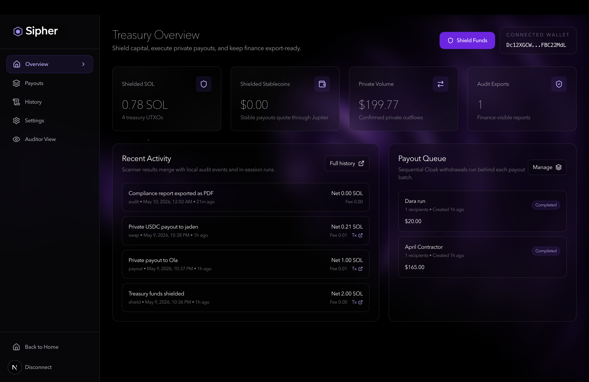

# Sipher



Sipher is private treasury operations for Solana teams, powered by Cloak.

Teams can shield treasury funds, run private SOL payouts from shielded balances, track per-recipient execution state, and export finance-readable history without reducing the product to a generic private-send demo.

## Features

- Shield SOL into Cloak's private UTXO pool
- Execute private SOL payouts from shielded treasury funds
- Compose reviewed payout runs for contractors, vendors, or contributors
- Track recipient-level execution status and transaction signatures
- Scan Cloak history with the treasury viewing key
- Export compliance-friendly PDF history reports
- Route stablecoin payout quotes through a server-side Jupiter quote proxy

## Tech Stack

- Next.js 16
- React 19
- TypeScript
- Tailwind CSS v4
- `@cloak.dev/sdk`
- Solana injected wallets: Phantom, Backpack, Solflare

## Getting Started

Install dependencies:

```bash
npm install
```

Create an environment file:

```bash
cp .env.example .env.local
```

Run the app:

```bash
npm run dev
```

Open `http://localhost:3000`.

## Environment

```bash
NEXT_PUBLIC_SOLANA_RPC_URL=https://api.mainnet-beta.solana.com
NEXT_PUBLIC_CLOAK_RELAY_URL=https://api.cloak.ag
NEXT_PUBLIC_CLOAK_PROGRAM_ID=zh1eLd6rSphLejbFfJEneUwzHRfMKxgzrgkfwA6qRkW
NEXT_PUBLIC_CLOAK_CIRCUITS_URL=https://cloak-circuits.s3.us-east-1.amazonaws.com/circuits/0.1.0
NEXT_PUBLIC_USDC_MINT=EPjFWdd5AufqSSqeM2qN1xzybapC8G4wEGGkZwyTDt1v
NEXT_PUBLIC_USDT_MINT=Es9vMFrzaCERmJfrF4H2FYD4KCoNkY11McCe8BenwNYB
JUPITER_API_KEY=
JUPITER_QUOTE_API_URL=https://api.jup.ag/swap/v1/quote
```

Use a reliable mainnet Solana RPC for real Cloak testing. The public Solana endpoint can reject Cloak Merkle tree account reads with `403 Access forbidden`.

## Mainnet Demo Flow

1. Connect a Solana wallet.
2. Shield a small amount of SOL.
3. Create a payout run.
4. Add a SOL recipient with a tiny amount such as `0.001 SOL`.
5. Review and execute the run.
6. Open run details and verify the transaction signature.
7. Scan history and export CSV.

## Scripts

```bash
npm run dev
npm run lint
npm run build
npm run start
```

The dev script uses `next dev --webpack` because Cloak's browser bundle depends on Node-style `Buffer` APIs during transaction construction. The project also configures Webpack to provide the full `buffer` polyfill.

## Deployment

Deploy on Vercel with the same environment variables from `.env.example`.

For mainnet demos, set `NEXT_PUBLIC_SOLANA_RPC_URL` to a provider URL that can read Cloak program accounts reliably.

## Notes

This is a hackathon product prototype. It has been tested with real mainnet shield and SOL payout flows, but production use would still require deeper wallet, key-management, audit, and operational controls.
